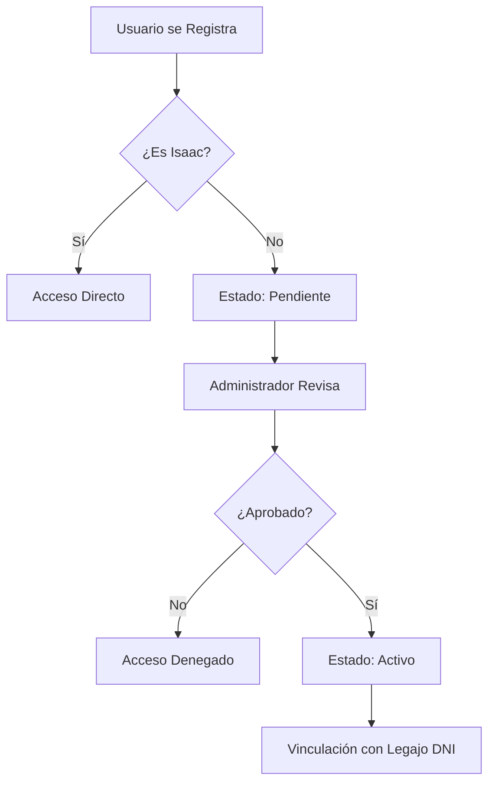
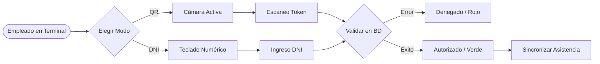
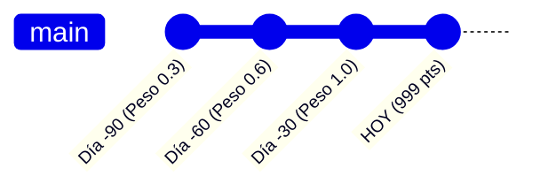

# Manual de Usuario: SecureQR Attendance System

Bienvenido al manual oficial de **SecureQR**, el sistema integral de control de asistencia diseñado para entornos industriales y corporativos de alta demanda.

---

## 1. Introducción y Acceso al Sistema

SecureQR utiliza tecnología de tokens únicos y persistentes vinculados al DNI y escaneo en tiempo real para garantizar que el registro de asistencia sea presencial, seguro y auditable.

### 1.1 Registro y Aprobación
Cuando un nuevo usuario se registra en la aplicación:
1.  **Estado Pendiente**: El acceso no es inmediato. Un administrador debe autorizar la cuenta.
2.  **Notificación**: El usuario verá un mensaje de "Acceso Pendiente" hasta que sea aprobado.
3.  **Vinculación**: El sistema vincula automáticamente la cuenta de usuario con el legajo de personal correspondiente mediante el DNI.

### 1.2 Roles del Sistema
*   **Superusuario**: Acceso total a la configuración del sistema y base de datos.
*   **Administrador**: Gestión de personal, usuarios, auditorías y análisis de fraude.
*   **Encargado**: Gestión de sectores específicos, personal a cargo y cronogramas.
*   **Empleado**: Solo puede ver su propio cronograma y su credencial digital.
*   **Terminal**: Rol restringido para dispositivos de marcación (tablets/PCs en puerta).

---

## 2. El Lector de Acceso (Modo Terminal)

La Terminal es el componente que se instala en los puntos de entrada/salida.

### 2.1 Configuración de la Terminal
Al iniciar la sesión como **Terminal**, se puede personalizar el nombre (ej: "Planta Norte" o "Entrada Principal").

*   **Nombre de Terminal**: Este nombre quedará registrado en cada marcación.
*   **Selección de Cámara**: El sistema permite alternar entre la cámara frontal y trasera (o externa) mediante el botón de cámara en la interfaz de escaneo. El sistema recordará su preferencia en este dispositivo.

### 2.2 Proceso de Marcado de Asistencia
Existen dos métodos para registrar la entrada/salida:
1.  **Escaneo QR**: El empleado muestra su credencial (física o digital) frente a la cámara. El sistema valida el token y registra el ingreso/egreso instantáneamente.
2.  **Ingreso por DNI**: En caso de fallas de cámara o pérdida de credencial, se puede usar el botón "Ingreso Manual" para tipear el número de documento.

**Motivos de Rechazo Comunes:**
*   **Ya Fichó**: Intento de duplicar entrada.
*   **Día de Descanso**: El empleado tiene asignado un día libre según su cronograma.
*   **Vacaciones**: El empleado se encuentra en periodo de licencia por vacaciones.
*   **Falta de Entrada**: Intento de marcar salida sin una entrada previa.

### 2.3 Modo Offline (Sin Internet)
Si la conexión a internet falla:
*   La terminal seguirá funcionando y guardará las fichadas localmente en el dispositivo.
*   Aparecerá un indicador de "Fichadas Pendientes" en color ámbar.
*   Una vez que vuelva la conexión, el sistema sincronizará automáticamente todos los datos con el servidor.

### 2.4 Cierre de Sesión Seguro (PIN)
Para evitar cierres accidentales o no autorizados, la salida del modo terminal está protegida. 
1.  Presione el botón **"Salir Terminal"** (esquina superior izquierda).
2.  Ingrese el PIN de seguridad: **0808**.
3.  Confirme el cierre de sesión.

---

## 3. Gestión de Personal y Scoring

Desde el módulo de **Personal**, los administradores y encargados coordinan a los equipos.

### 3.1 Alta de Empleados
Al registrar un nuevo ingreso, es vital completar:
*   **DNI**: Identificador único para el autómata de registro.
*   **Sector Principal**: Área donde el empleado realiza sus tareas habitualmente.
*   **Sectores Gestionados**: (Solo para encargados) Áreas adicionales que este usuario podrá supervisar.

### 3.2 El Módulo de Scoring
El sistema califica automáticamente el comportamiento de asistencia en los últimos 90 días:
*   **Puntaje Máximo**: 999 puntos.
*   **Clases de Scoring**:
    *   🟣 **Clase 0 (Altamente Puntual)**: Nivel de excelencia técnica en asistencia.
    *   🟢 **Clase 1 (Excelente)**: Asistencia casi perfecta, sin ausencias.
    *   🟡 **Clase 2 (Estable)**: Algunas tardanzas breves esporádicas.
    *   🟠 **Clase 3 (Regular)**: Reiteración de faltas o tardanzas.
    *   🔴 **Clase 4 (Alerta)**: Problemas persistentes de conducta.
    *   🌑 **Clase 5 (Crónica)**: Nivel crítico de incumplimiento.

> [!NOTE]
> El Scoring es dinámico. Las faltas recientes afectan más al puntaje que las antiguas.

### 3.3 Emisión de Credenciales
Cada empleado tiene un carnet único. Desde el panel de personal se puede:
*   Visualizar el carnet con QR.
*   Descargar el carnet como imagen (PNG) individual.
*   **Descarga Masiva (ZIP)**: Permite descargar todos los carnets del sector seleccionado en un solo archivo comprimido listo para imprimir o distribuir.
*   Imprimir credenciales físicas directamente.

---

## 4. Horarios y Cronogramas

El sistema permite una flexibilidad total en la planificación del trabajo.

### 4.1 Pantillas de Horario Habitual (Base)
Se define para cada empleado su semana estándar:
*   **Turno Corrido**: Entrada y salida única.
*   **Turno Cortado**: Dos tramos horarios (mañana y tarde).
*   **Descansos**: Días libres programados.

### 4.2 Excepciones Semanales
Si un empleado debe cambiar de turno por una semana específica:
1.  Vaya al módulo de **Cronogramas**.
2.  Busque al empleado y seleccione el día.
3.  Modifique el horario. Esta excepción prevalecerá sobre la "Plantilla Base" solo durante esos días.

---

## 5. Monitoreo y Auditoría

Para garantizar la integridad de los datos, el sistema ofrece tres niveles de revisión:

### 5.1 Logs de Sistema
Registra cada cambio manual realizado por un administrador (ej: "Se cambió el horario de Ana García por motivo X"). Permite saber **quién, cuándo y por qué** se modificó un dato.

### 5.2 Auditoría de Personal
Muestra un resumen mensual por empleado con:
*   Minutos totales de tardanza.
*   Cantidad de ausencias.
*   Veces que perdió el presentismo por exceder la tolerancia técnica.

### 5.3 Análisis de Fraude
Módulo basado en patrones que detecta:
*   Marcaciones sospechosas (ej: dos fichadas en tiempos imposibles).
*   Anomalías en el uso de la terminal.
*   Recomendaciones administrativas automáticas.

---

## 6. Gestión de Sectores y Usuarios (Configuración)

### 6.1 Sectores Gestionados (Para Encargados)
Un **Encargado** puede tener bajo su supervisión más de un área. Al editar un perfil de encargado:
*   **Sector Principal**: Define dónde ficha habitualmente el encargado.
*   **Sectores Adicionales**: Permite que el encargado vea el listado de personal y cronogramas de otras áreas (ej: "Mantenimiento" + "Limpieza").

### 6.2 Matriz de Roles Dinámica
El sistema no depende de roles estáticos. El Superusuario puede crear nuevos roles y asignar permisos granulares (ej: un rol "Visualizador" que solo vea auditorías pero no pueda editar personal).

---

## 7. Resolución de Problemas (Troubleshooting)

| Problema | Causa Probable | Solución |
| :--- | :--- | :--- |
| **La cámara no enciende** | Permisos del navegador denegados. | Clic en el icono del candado (barra de direcciones) y permitir Cámara. |
| **Cámara equivocada** | Selección de cámara errónea. | Use el botón de cambio de cámara en la interfaz de escaneo. |
| **QR no reconocido** | Token expirado o luz insuficiente. | Intentar ingreso manual o subir el brillo del teléfono. |
| **Error 'Duplicate'** | Intento de doble fichada. | Espere 10 minutos entre marcas del mismo tipo. |
| **Acceso Denegado** | Día libre o vacaciones. | Verifique el cronograma del empleado en el módulo Auditoría. |
| **No puedo salir de Terminal** | Protección por PIN activa. | Use el PIN **0808** tras presionar "Salir Terminal". |
| **Acceso Bloqueado** | Cuenta suspendida. | Contactar al Superusuario para revisar el log de suspensión. |

---

## 8. Preguntas Frecuentes (FAQ)

**¿Puedo imprimir el QR en una tarjeta de PVC?**
Sí. Los códigos son persistentes. Una vez impreso, servirá indefinidamente a menos que un administrador cambie el código del usuario manualmente.

**¿Qué pasa si el empleado olvida marcar la salida?**
El administrador puede realizar un "Cierre Manual" desde la Auditoría de Personal para evitar que el registro quede abierto eternamente.

**¿El sistema detecta si alguien usa una foto del código?**
El módulo de Análisis de Fraude detecta registros en tiempos imposibles o desde terminales no habituales, alertando a la administración.

---

> [!TIP]
> **Recordatorio de Seguridad**: Nunca comparta su contraseña de Administrador. Todas las acciones quedan grabadas con su nombre en el Log de Auditoría.
