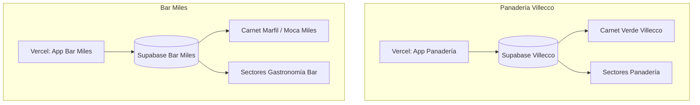
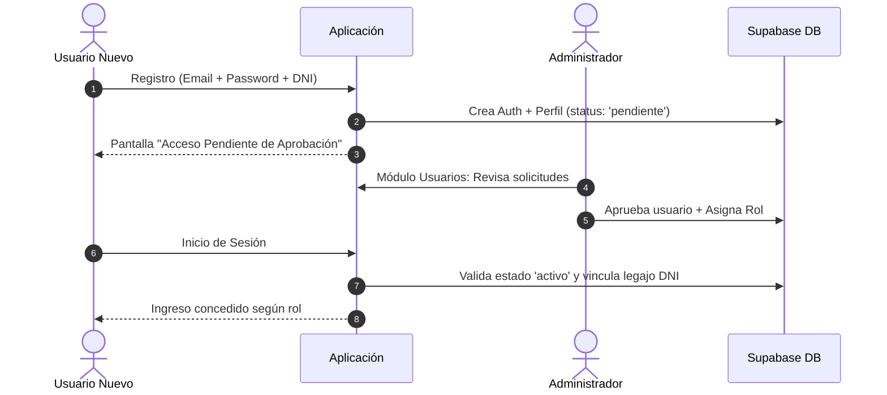
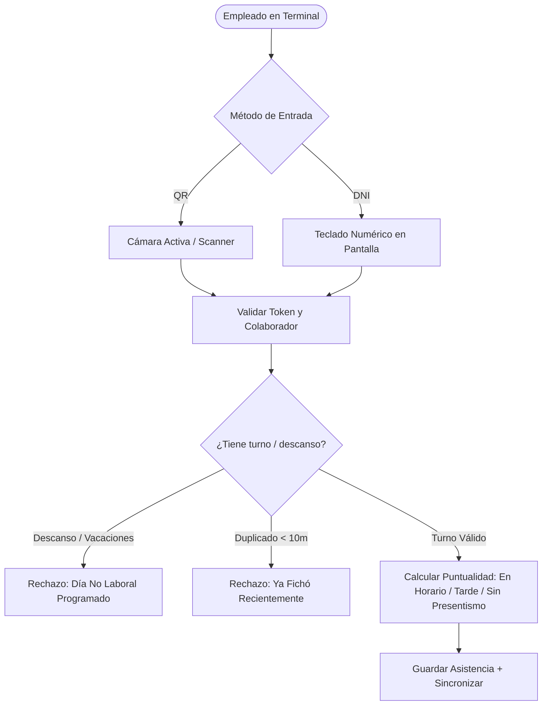

# Manual de Usuario Oficial: SecureQR Attendance System
### Panadería Villecco (Desde 1925) & Bar Miles

Bienvenido al manual operativo integral de **SecureQR**, el sistema biométrico y digital de control de asistencia, cronogramas, auditoría y legajos diseñado para operaciones continuas de alta demanda comercial y gastronómica.

---

## 1. Introducción y Arquitectura del Sistema

SecureQR opera como una plataforma robusta, confiable y segura basada en tokens QR persistentes vinculados al DNI del personal. Combina validación de reglas de turnos en milisegundos con auditoría inmutable de cambios y tolerancia total a cortes de energía o internet.

### 1.1 Modelo Multi-Empresa Independiente

El sistema atiende a dos empresas totalmente diferenciadas e independientes:

| Atributo | Panadería Villecco | Bar Miles |
| :--- | :--- | :--- |
| **Razón / Nombre** | Panadería Villecco (Desde 1925) | Bar Miles (Miles Bar & Resto) |
| **Identidad Visual** | Verde institucional (`#1B4332`, `#2D6A4F`, `#52B788`) con detalles trigo/dorado | Lino/marfil cálido (`#FAF8F5`), acentos moca/café (`#B89E84`, `#A08266`) y serif vintage |
| **Logotipo** | Sello tradicional con espigas de trigo y leyenda histórica | Isologo circular de sello con tipografía de bar vintage |
| **Credenciales** | Carnet verde esmeralda con triple ola inferior y logo Villecco | Carnet lino/marfil con logo de Staff, cinta tricolor y reborde moca |
| **Infraestructura Supabase** | Base de datos principal de Villecco | Base de datos dedicada e independiente (`sgtsslarkrtacgaadoxt`) |
| **Despliegue Vercel** | Aplicación web exclusiva de Villecco | Aplicación web exclusiva de Bar Miles |
| **Sectores Operativos Típicos** | Cuadra / Panificados, Pastelería, Mostrador, Envasado, Reparto, Mantenimiento, Administración | Barra, Cocina, Salón / Mozos, Caja, Bachero / Limpieza, Seguridad / Recepción, Administración |

> [!IMPORTANT]
> **Separación Total**: Las bases de datos y accesos de **Panadería Villecco** y **Bar Miles** están completamente aislados en Supabase y Vercel. En ningún formulario ni vista de personal se requiere seleccionar la empresa: cada aplicación ya sabe por su entorno a qué negocio pertenece, protegiendo la privacidad y evitando cualquier mezcla de personal.

```mermaid
graph TD
    subgraph "Panadería Villecco"
        V_Vercel[Vercel: App Panadería] --> V_DB[(Supabase Villecco)]
        V_DB --> V_Badge[Carnet Verde Villecco]
        V_DB --> V_Sectors[Sectores Panadería]
    end

    subgraph "Bar Miles"
        M_Vercel[Vercel: App Bar Miles] --> M_DB[(Supabase Bar Miles)]
        M_DB --> M_Badge[Carnet Marfil / Moca Miles]
        M_DB --> M_Sectors[Sectores Gastronomía Bar]
    end
```

---

## 2. Acceso, Seguridad y Roles

### 2.1 Flujo de Registro y Aprobación
1. **Registro Inicial**: El empleado o encargado se registra con su correo electrónico y contraseña.
2. **Estado Pendiente**: Toda nueva cuenta queda automáticamente en **Estado Pendiente**. No podrá ingresar a datos operativos hasta ser aprobada.
3. **Revisión Administrativa**: Un Administrador o Superusuario revisa el registro desde el módulo de **Gestión de Usuarios**, asigna el rol y aprueba la cuenta.
4. **Vinculación con Legajo**: El sistema asocia la cuenta de autenticación con el legajo de personal mediante el **DNI** registrado.

```mermaid
sequenceDiagram
    autonumber
    actor U as Usuario Nuevo
    participant App as Aplicación
    actor Admin as Administrador
    participant DB as Supabase DB

    U->>App: Registro (Email + Password + DNI)
    App->>DB: Crea Auth + Perfil (status: 'pendiente')
    App-->>U: Pantalla "Acceso Pendiente de Aprobación"
    Admin->>App: Módulo Usuarios: Revisa solicitudes
    Admin->>DB: Aprueba usuario + Asigna Rol
    U->>App: Inicio de Sesión
    App->>DB: Valida estado 'activo' y vincula legajo DNI
    App-->>U: Ingreso concedido según rol
```

### 2.2 Jerarquía de Roles y Permisos

| Rol | Alcance y Facultades |
| :--- | :--- |
| **Superusuario** | Acceso irrestricto a toda la base de datos, matriz de roles, configuración avanzada, eliminación forzada y auditoría general. |
| **Administrador** | Gestión total de personal, altas/bajas, cronogramas, auditoría de asistencia, recalculo de periodos, exportaciones, solicitudes de RRHH y gestión de usuarios. |
| **Encargado** | Supervisión de los sectores que tiene asignados (`managed_sectors`). Puede cargar horarios, justificar inasistencias y aprobar solicitudes de su equipo. |
| **Empleado** | Acceso exclusivamente a su **Credencial Digital** con código QR y a la consulta de sus propios horarios y solicitudes. |
| **Terminal** | Modo operativo kiosco diseñado para tablets o PCs de entrada/salida. Solo permite registrar fichadas y está protegido contra cierre accidental por PIN. |

---

## 3. El Lector de Acceso (Modo Terminal)

La Terminal es el puesto de control donde el personal registra sus entradas y salidas al iniciar o finalizar sus turnos.

### 3.1 Métodos de Fichada
* **Escaneo de Código QR**: El colaborador aproxima su carnet físico o digital a la cámara. El escáner detecta instantáneamente el token criptográfico y registra la asistencia.
* **Marcación por DNI (Teclado en Pantalla)**: Si el colaborador olvidó su carnet o la cámara del dispositivo sufre alguna contingencia física, se presiona **"Ingreso Manual"** y se tipea el DNI.

### 3.2 Controles y Validaciones Automáticas
* **Control Antifraude / Duplicidad**: Impide que una persona marque dos veces seguidas por error (ventana de protección de 10 minutos).
* **Validación de Licencias y Descansos**: Si el colaborador tiene asignado día de descanso, vacaciones o licencia médica aprobada, la terminal no genera una asistencia común y alerta en pantalla.
* **Feedback Visual Inmediato**: 
  - **Verde**: Fichada válida registrada con éxito (indica nombre, hora, condición de llegada y tolerancia).
  - **Rojo / Alerta**: Fichada rechazada (fuera de rango de tolerancia, descanso programado o duplicado).

```mermaid
flowchart TD
    A([Empleado en Terminal]) --> B{Método de Entrada}
    B -- QR --> C[Cámara Activa / Scanner]
    B -- DNI --> D[Teclado Numérico en Pantalla]
    C --> E[Validar Token y Colaborador]
    D --> E
    E --> F{¿Tiene turno / descanso?}
    F -- Descanso / Vacaciones --> G[Rechazo: Día No Laboral Programado]
    F -- Duplicado < 10m --> H[Rechazo: Ya Fichó Recientemente]
    F -- Turno Válido --> I[Calcular Puntualidad: En Horario / Tarde / Sin Presentismo]
    I --> J[Guardar Asistencia + Sincronizar]
```

### 3.3 Modo Centinela (Operación Offline sin Internet)
Si la panadería o el bar sufren una caída del servicio de internet:
1. La terminal **no se interrumpe**: continúa escaneando y validando DNI localmente.
2. Las marcaciones se encriptan y almacenan en el almacenamiento local del dispositivo (`IndexedDB` / `localStorage`).
3. Aparece una insignia ámbar con el conteo de **"Fichadas Pendientes de Sincronización"**.
4. Apenas se reanuda la conexión a internet, el motor en segundo plano sube todas las fichadas en orden cronológico estricto sin perder ningún minuto.

### 3.4 Selector de Cámara y Cierre Seguro por PIN
* **Cambio de Cámara**: Con el botón de cámara en pantalla, el operador puede alternar entre cámara frontal, trasera o una cámara USB conectada. La elección queda guardada en la memoria del navegador.
* **Protección de Salida por PIN**: Para que ningún empleado pueda cerrar la terminal por error o malicia:
  1. Presione **"Salir Terminal"** (arriba a la izquierda).
  2. Ingrese el **PIN maestro de administrador**.
  3. Confirme el cierre para regresar al panel administrativo.

---

## 4. Gestión de Personal y Credenciales

Desde el módulo de **Personal**, los administradores gestionan los legajos de colaboradores activos e inactivos.

### 4.1 Alta y Edición de Colaboradores
Campos obligatorios y configuraciones clave:
* **DNI**: Documento Nacional de Identidad (único; clave de sincronización con la base de datos).
* **Nombre y Apellido**: Nombre completo tal como figurará en su credencial.
* **Tipo de Personal**:
  - **Efectivo**: Empleado permanente bajo relación laboral estándar (elegible para francos compensatorios por domingos y feriados trabajados).
  - **Jornalero**: Personal por jornada o eventual.
* **Sector / Área**:
  - En **Panadería Villecco**: Cuadra, Pastelería, Mostrador, Envasado, Reparto, Mantenimiento, Administración.
  - En **Bar Miles**: Barra, Cocina, Salón / Mozos, Caja, Bachero, Seguridad, Administración.
* **Rol en el Sistema**: Rol que tendrá en caso de que también acceda al sistema web.

### 4.2 Emisión y Descarga de Carnets (Individual y Masiva ZIP)
* **Visualización en Pantalla**: Permite abrir el carnet con alta fidelidad para verificar su diseño y datos.
* **Descarga Individual (PNG)**: Exporta una imagen de 500x330 px lista para credenciales de PVC o tarjetas térmicas.
* **Descarga Masiva (ZIP)**: Genera un archivo comprimido que contiene los carnets de todos los empleados del sector seleccionado o de toda la empresa, nombrados automáticamente por nombre y DNI.

#### Diseños de Carnet por Empresa:
* **Panadería Villecco**: Fondo blanco nítido con el logotipo oficial histórico (`.PANADERIA. Villecco DESDE 1925`), nombre en negrita institucional, QR en verde bosque (`#1B4332`) y triple ola inferior dinámica (`#52B788`, `#2D6A4F`, `#1B4332`).
* **Bar Miles**: Fondo marfil/lino suave (`#FAF8F5`), marco fino artesanal, sello circular del Bar Miles Staff, tipografía serif vintage, código QR en café oscuro (`#1C1917`) con acentos moca (`#B89E84`) y cinta tricolor inferior.

---

## 5. El Sistema de Scoring de Asistencia

El scoring es un algoritmo matemático dinámico que evalúa la disciplina y puntualidad del personal en una escala de **0 a 999 puntos**.

### 5.1 Clases de Clasificación

| Puntaje | Clase | Nivel | Significado Operativo |
| :---: | :--- | :---: | :--- |
| **990 - 999** | **Clase 0** | 🟣 Púrpura | **Altamente Puntual**: Asistencia y puntualidad ejemplar. |
| **950 - 989** | **Clase 1** | 🟢 Verde | **Excelente**: Muy buena conducta, sin faltas graves. |
| **750 - 949** | **Clase 2** | 🟡 Amarillo | **Estable**: Desviaciones menores o tardanzas leves aisladas. |
| **500 - 749** | **Clase 3** | 🟠 Naranja | **Regular**: Reiteración de demoras o inasistencia que requiere seguimiento. |
| **250 - 499** | **Clase 4** | 🔴 Rojo | **Alerta**: Incumplimiento severo reiterado; requiere apercibimiento. |
| **0 - 249** | **Clase 5** | ⚫ Negro | **Crónica**: Nivel crítico con riesgo inminente de sanción disciplinaria o baja. |

### 5.2 Tabla de Descuentos por Infracción

| Evento de Asistencia | Descuento Base | Penalización por Minutos |
| :--- | :---: | :--- |
| **Llegada Tarde (`tarde`)** | -20 pts | +1 punto por cada minuto de tardanza real |
| **Sin Presentismo (`sin_presentismo`)** | -100 pts | +1 punto por cada minuto de tardanza acumulado |
| **Ausencia Injustificada (`ausente`)** | -250 pts | Fija por jornada laboral adeudada |
| **Licencia Médica (`licencia_medica`)** | -20 pts | Máximo de 100 puntos en el período evaluado |

> [!NOTE]
> No descuentan puntos: días de descanso, vacaciones, francos compensatorios, suspensiones disciplinarias ni ausencias con justificación administrativa.

### 5.3 Factor de Decaimiento por Antigüedad (Ventana de 90 Días)
El sistema pondera más las infracciones recientes que las pasadas para premiar la recuperación del colaborador:
* **Últimos 30 días**: Se computa el **100%** del descuento.
* **De 31 a 60 días atrás**: Se computa el **60%** del descuento.
* **De 61 a 90 días atrás**: Se computa el **30%** del descuento.
* **Más de 90 días**: La falta caduca y ya no afecta el puntaje actual.

**Ejemplo Práctico**:
Un colaborador con 999 puntos llega 15 minutos tarde en la semana corriente:
- Descuento base: 20 pts + 15 pts por minutos = **35 pts**.
- Ponderación (últimos 30 días): 100% $\to$ **35 pts**.
- Nuevo puntaje: $999 - 35 = \mathbf{964\text{ pts}}$ (Clase 1 - Excelente).

---

## 6. Horarios, Cronogramas y Francos Compensatorios

### 6.1 Plantilla Base vs. Excepciones Semanales
El sistema utiliza una arquitectura jerárquica de resolución de turnos:
1. **Plantilla Base (Horario Habitual)**: Define el régimen semanal tipo del empleado (por ejemplo: Lunes a Viernes de 07:00 a 15:00, Sábados de 08:00 a 13:00, Domingos Descanso).
2. **Excepciones Semanales**: Cualquier turno o descanso cargado específicamente en el módulo de **Cronogramas** sobreescribe la plantilla base para esa fecha exacta.

### 6.2 Tipos de Turnos Admitidos
* **Turno Corrido**: Un único segmento con hora de entrada y hora de salida (ej. 06:00 a 14:00).
* **Turno Cortado (Partido)**: Dos segmentos en el mismo día (ej. Segmento 1: 08:00 a 12:00; Segmento 2: 16:30 a 20:30). La terminal evalúa la puntualidad de cada segmento con sus respectivas tolerancias.
* **Turno Nocturno**: Horarios que cruzan la medianoche (ej. 21:00 a 05:00). El sistema asocia la fichada de salida de la madrugada a la jornada iniciada la noche anterior.
* **Descanso / Franco**: Día libre programado.

### 6.3 Módulo de Francos Compensatorios
Diseñado especialmente para la actividad comercial de panadería y gastronomía de bar:

#### Acreditación de Crédito (Reglas de Negocio):
1. Aplica a colaboradores con tipo de contratación **Efectivo**.
2. Si el empleado tiene turno laboral asignado en un **Domingo** o en un **Feriado Oficial** y registra una fichada real de entrada (`check_in`), acredita **+1 Franco Compensatorio**.
3. Los turnos nocturnos de sábado que se extienden al domingo computan como trabajo dominical.

#### Uso y Saldo:
* El saldo acumulado se refleja en el legajo del colaborador (`compensatory_rest_balance`).
* Al programar en el cronograma un día como **"Franco Compensatorio"**, el saldo no se descuenta hasta que llega o transcurre la fecha programada.
* Los encargados pueden ver el saldo disponible antes de otorgar el franco.

---

## 7. Auditoría de Personal y Liquidación

El módulo de **Auditoría de Personal** es el núcleo de control mensual y la fuente de datos para la liquidación de haberes.

### 7.1 Vistas Disponibles
* **Resumen Mensual**: Tabla global que consolida por empleado:
  - Días trabajados y jornadas cumplidas.
  - Minutos totales de llegada tarde.
  - Cantidad de veces que perdió el presentismo técnico.
  - Inasistencias injustificadas vs. justificadas.
  - Puntaje de Scoring y clasificación actual.
* **Vista Calendario**: Grilla mensual interactiva donde cada celda muestra el estado del día:
  - 🟢 **Verde**: Presente / En Horario.
  - 🟡 **Amarillo**: Llegó tarde (con indicación de minutos).
  - 🟠 **Naranja**: Sin presentismo (excedió la tolerancia máxima).
  - 🔴 **Rojo**: Ausente injustificado.
  - 🔵 **Azul**: Descanso programado o Franco Compensatorio.
  - 🟣 **Violeta**: Licencia médica o vacaciones aprobadas.

### 7.2 Herramientas de Corrección y Gestión
* **Recalcular Período**: Si se corrige un horario en cronogramas con fecha retroactiva, este botón reprocesa automáticamente las fichadas del empleado contra el nuevo horario, eliminando inasistencias generadas erróneamente y recalculando tardanzas y scoring.
* **Edición Horaria (Ícono de Lápiz ✏️)**: Permite ajustar la hora exacta de una entrada o salida si el colaborador fichó tarde por causas de fuerza mayor debidamente autorizadas.
* **Anulación de Fichada (Ícono de Papelera 🗑️)**: Elimina una fichada duplicada o errónea para que el sistema permita la marcación correcta.
* **Cierre Manual de Jornada**: Si un empleado se retiró sin marcar la salida, el supervisor puede consignar la hora de egreso estimada para evitar registros incompletos.
* **Exportación CSV / Excel**: Genera un archivo con el detalle exacto de horas y minutos listos para importar en el software de liquidación de sueldos.

---

## 8. Legajos Digitales y Documentación

Desde la ficha del empleado (**Legajo Digital**), los administradores centralizan toda la historia laboral:

### 8.1 Secciones del Legajo
* **Ficha Personal y Familiar**: Datos de contacto, DNI, CUIL, domicilio, grupo familiar, contacto de emergencia y datos de salud.
* **Documentación Adjunta**: Repositorio seguro para subir y consultar:
  - Copia de DNI y CUIL.
  - Contrato de trabajo y alta temprana en AFIP / ARCA.
  - Recibos de sueldo firmados.
  - Libreta Sanitaria (indispensable para Villecco y Miles).
  - Certificados de cursos de manipulación de alimentos.
* **Historial de Sanciones y Notificaciones**:
  - Registro de llamados de atención verbales y apercibimientos por escrito.
  - Suspensiones disciplinarias con fechas de inicio y fin.
* **Movimientos de Francos Compensatorios**:
  - Libro mayor (*ledger*) de acreditaciones y débitos de francos compensatorios con fecha, motivo y supervisor que lo autorizó.

---

## 9. Módulo de Solicitudes de RRHH (HrRequests)

Canal formal para la gestión ordenada de ausencias y permisos del personal.

### 9.1 Tipos de Solicitudes
1. **Licencia Médica**: Permite al colaborador o encargado cargar el certificado médico expedido por el profesional, diagnóstico, días de reposo y fecha de alta.
2. **Vacaciones**: Solicitud de período de descanso anual con fecha de inicio y reincorporación.
3. **Franco Compensatorio**: Pedido para gozar de un franco compensatorio adeudado.
4. **Permiso Especial / Justificación**: Trámites personales, exámenes, días de estudio o duelo familiar.

### 9.2 Circuito de Aprobación
* La solicitud entra en estado **"Pendiente"**.
* El Encargado o Administrador revisa el adjunto y los antecedentes.
* Al hacer clic en **"Aprobar"**:
  - El sistema impacta automáticamente en el cronograma semanal del colaborador para las fechas solicitadas.
  - La terminal no considerará al empleado como ausente en esos días.
  - En la auditoría mensual el día quedará computado con su estado correspondiente sin penalizar el scoring.

---

## 10. Auditoría de Sistema y Análisis de Fraude

Para asegurar la transparencia y evitar manipulaciones en los registros, el sistema incluye dos capas de seguridad forense:

### 10.1 Registro de Eventos del Sistema (Audit Log)
Cada vez que un usuario con privilegios realiza una acción en la plataforma, queda grabada una traza inmutable:
* **Quién**: Nombre y correo del usuario que realizó la acción.
* **Cuándo**: Marca temporal exacta (fecha, hora, minuto y segundo).
* **Qué**: Acción ejecutada (ej. `Modificación de Horario`, `Justificación de Inasistencia`, `Alta de Personal`, `Edición de Marcación`).
* **Valor Anterior vs. Valor Nuevo**: Comparativa de los datos modificados.
* **Motivo Obligatorio**: Justificación textual ingresada por el supervisor.

### 10.2 Módulo de Análisis de Fraude
Algoritmo de detección de anomalías que escanea en tiempo real:
* **Fichadas Simultáneas o en Tiempos Imposibles**: Registros realizados con pocos segundos de diferencia en terminales distintas.
* **Fichadas Fuera de Rango**: Marcaciones con IP o dispositivo no reconocido como terminal autorizada.
* **Patrones Repetitivos Sospechosos**: Análisis de conductas atípicas en marcaciones manuales por DNI.

---

## 11. Configuración, Sectores, Roles y Tolerancias

El módulo de **Configuración** (`SettingsView`) permite ajustar los parámetros neurálgicos de cada empresa:

### 11.1 Parámetros de Tolerancia Técnica de Fichadas
* **Tolerancia en Horario**: Minutos de gracia tras el horario pautado en los que la llegada se considera puntual (típicamente 5 a 10 minutos).
* **Umbral de Llegada Tarde**: Margen dentro del cual se computa "Llegada Tarde" con descuento proporcional en scoring.
* **Umbral de Pérdida de Presentismo**: Minutos a partir de los cuales el colaborador pierde el presentismo técnico del turno.
* **Ventana de Anticipación**: Cuántos minutos antes del inicio del turno la terminal permite fichar (para evitar que se computen horas extra no autorizadas).

### 11.2 Feriados y Días No Laborables
Calendario oficial de feriados nacionales y provinciales. Al dar de alta un feriado:
* El sistema lo reconoce en cronogramas.
* Si el personal efectivo trabaja en ese día, el motor de francos compensatorios le acredita su compensatorio correspondiente.

---

## 12. Instalación como PWA y Resolución de Problemas

### 12.1 Instalación como App (Progressive Web App)
Tanto la aplicación de **Panadería Villecco** como la de **Bar Miles** son PWAs instalables en cualquier plataforma:
* **En Tablets y Celulares Android / iOS**:
  1. Abra el navegador (Chrome en Android, Safari en iOS).
  2. Presione el botón flotante verde con el ícono de descarga (📥) en la esquina inferior derecha o seleccione *"Agregar a la pantalla de inicio"*.
  3. La app se instalará con ícono propio y se ejecutará a pantalla completa sin barra de navegación.
* **En Computadoras (Windows / Mac)**:
  1. En Google Chrome o Edge, haga clic en el ícono de instalación en la barra de direcciones.
  2. Se creará un acceso directo en el escritorio con ventana nativa de alta velocidad.

---

### 12.2 Tabla de Resolución de Problemas Frecuentes (Troubleshooting)

| Síntoma / Problema | Causa Probable | Procedimiento de Solución |
| :--- | :--- | :--- |
| **La cámara de la terminal no enciende** | Permisos de cámara bloqueados en el navegador. | Haga clic en el ícono del candado junto a la URL del navegador y cambie el permiso de "Cámara" a **Permitir**. Luego recargue la página. |
| **La terminal enfoca con la cámara equivocada** | Selección incorrecta en dispositivos con múltiples lentes. | Presione el botón con el ícono de cámara en la pantalla de escaneo para alternar a la cámara adecuada. El sistema recordará la preferencia. |
| **El lector no lee el código QR** | Pantalla del celular con brillo bajo o carnet físico deteriorado. | Suba el brillo de la pantalla al 100%, acerque el código a 15-20 cm de la cámara o use el botón **"Ingreso Manual"** tipeando el DNI. |
| **Mensaje: "Ya fichó recientemente"** | Doble marcación accidental dentro de la ventana de 10 min. | Aguarde a que transcurra el intervalo de seguridad si se trata de un nuevo tramo o consulte al encargado. |
| **Acceso Denegado por "Día de Descanso"** | El empleado asistió en un día libre sin aviso previo en cronograma. | El encargado debe ingresar al módulo de **Cronogramas**, cargar el turno para esa fecha y luego presionar **"Recalcular Período"** en Auditoría. |
| **No puedo salir del Modo Terminal** | Bloqueo intencional por PIN de seguridad. | Presione **"Salir Terminal"** (arriba a la izquierda), ingrese el PIN maestro administrativo y confirme el cuadro de diálogo. |
| **La terminal muestra fichadas pendientes en ámbar** | Pérdida de conexión a internet en el local. | No cierre la app ni borre los datos de navegación. La terminal continuará operando y sincronizará todo automáticamente en cuanto retorne la red. |
| **Un colaborador figura ausente habiendo trabajado** | Olvido de fichada o error en el cronograma base. | Corrija el cronograma del día en **Cronogramas**, cargue la fichada manual en **Auditoría de Personal** y presione **"Recalcular Período"**. |

---

## 13. Preguntas Frecuentes (FAQ)

**1. ¿Las credenciales impresas pierden vigencia con el tiempo?**
No. El token QR está vinculado de forma persistente y segura al DNI del colaborador. Una vez impreso en tarjeta plástica o papel plastificado, sirve indefinidamente a menos que un administrador regenere expresamente el token por extravío.

**2. ¿Qué ocurre si un colaborador de la Panadería o del Bar trabaja en su día de descanso?**
Si el colaborador es efectivo y trabaja un domingo o feriado, el sistema le acreditará automáticamente 1 Franco Compensatorio en su legajo una vez que fiche y finalice la jornada.

**3. ¿Cómo se respalda la información de las dos empresas?**
Tanto **Panadería Villecco** como **Bar Miles** cuentan con réplicas y copias de seguridad continuas y automáticas en sus respectivos servidores de Supabase, garantizando disponibilidad 24/7 y cero pérdida de datos.

---

> [!TIP]
> **Recomendación de Seguridad Operativa**: Cada supervisor o administrador debe utilizar su propia cuenta de acceso personal y nunca compartir contraseñas ni el PIN maestro de la terminal. Todas las modificaciones horarias quedan registradas en el Log de Auditoría con nombre, apellido y fecha.
